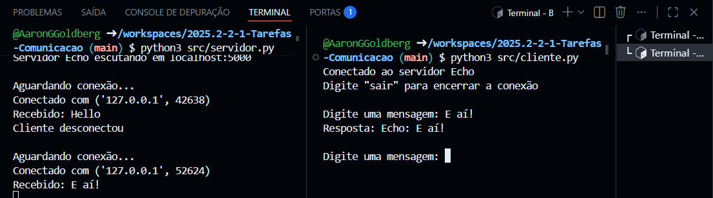
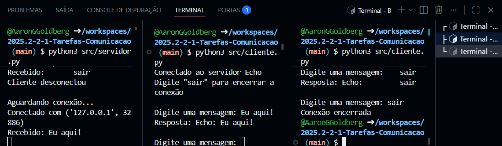
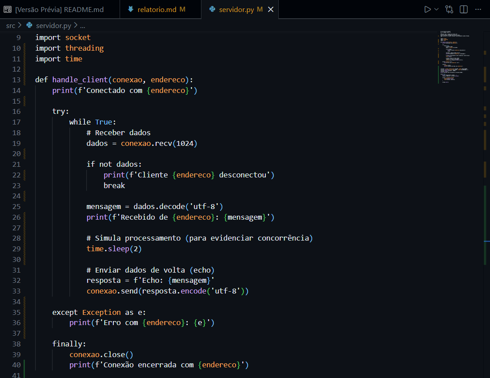
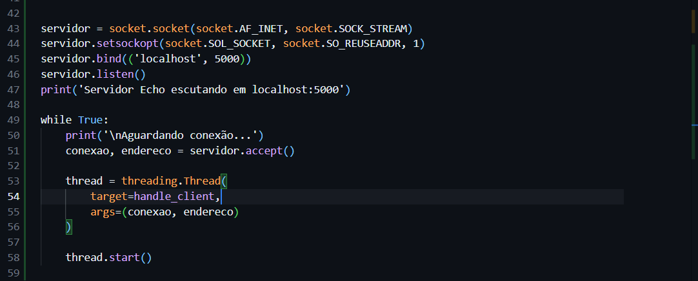
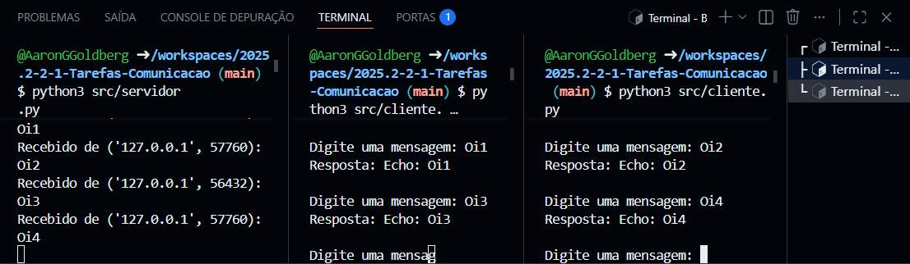

# Relato da atividade de comunicação entre processos usando sockets

## Informações gerais

* **disciplina**: Sistemas Operacionais
* **semestre letivo**: 2025.2
* **aluno**: Aaron Guerra Goldberg

## Parte 1 — 1 servidor e 1 cliente (bloqueante)

Executei o servidor com `python3 src/servidor.py` e ele iniciou corretamente, ficando na porta 5000 aguardando conexão.

Em seguida, executei o cliente com `python3 src/cliente.py`. O cliente conectou imediatamente ao servidor.

Enviei uma mensagem ("Olá, meu amigo Servidor") e recebi como resposta do servidor a mensagem no formato `"Echo: <mensagem>"`. O servidor exibiu corretamente no terminal a mensagem recebida do cliente.

Finalize o cliente digitando `"sair"`, e o servidor permaneceu ativo, aguardando novas conexões. O encerramento ocorreu de forma limpa, sem erros ou exceções.

## Parte 2 — 1 servidor e 2 clientes (bloqueante)

Executei dois clientes quase simultaneamente conectando ao mesmo servidor.

Foi possível observar que o servidor atende apenas um cliente por vez. Enquanto o cliente 1 estava em comunicação ativa com o servidor, o cliente 2 permaneceu bloqueado aguardando atendimento.

Somente após o encerramento da conexão do primeiro cliente o servidor passou a atender o segundo. Não ocorreram exceções, porém ficou evidente que o processamento é totalmente serializado, pois as mensagens aparecem no log do servidor de forma sequencial, nunca de maneira simultânea.

## Parte 3 — Modificar o servidor para múltiplos clientes

Nesta etapa, o servidor foi modificado para permitir o atendimento de múltiplos clientes de forma concorrente. Para isso, foi adotada a estratégia de **threads**, onde cada nova conexão aceita pelo servidor cria uma nova thread responsável por tratar aquele cliente.

Dessa forma, o laço principal do servidor retorna imediatamente ao `accept()`, permitindo que novas conexões sejam aceitas sem bloquear o atendimento das já existentes. O protocolo de comunicação entre cliente e servidor foi mantido o mesmo, alterando apenas a forma de tratamento das conexões.

Também foi implementado tratamento de exceções em cada thread, garantindo que erros em uma conexão não derrubem o servidor. Os sockets são fechados corretamente ao final de cada comunicação, assegurando estabilidade e bom uso dos recursos.

## Parte 4 — 1 servidor (concorrente) e 2 clientes

Após a modificação do servidor para o modelo concorrente, executei novamente dois clientes quase ao mesmo tempo.

Diferentemente do comportamento observado anteriormente, ambos os clientes conseguiram se conectar e trocar mensagens com o servidor simultaneamente. As respostas foram recebidas sem que um cliente precisasse aguardar o término do outro.

Os logs do servidor mostraram múltiplas conexões ativas ao mesmo tempo, evidenciando o processamento concorrente. Não houve bloqueios, exceções não tratadas ou falhas no encerramento das conexões.

## Conclusão

A atividade permitiu compreender, de forma prática, as diferenças entre um modelo de comunicação bloqueante e um modelo concorrente em aplicações cliente-servidor. No modelo inicial, o servidor atende apenas um cliente por vez, o que limita a escalabilidade e pode causar atrasos quando múltiplos clientes tentam acessar o serviço simultaneamente.

Com a implementação da concorrência por meio de threads, o servidor passou a atender vários clientes ao mesmo tempo, tornando-se mais eficiente e adequado a cenários reais. Essa prática reforça conceitos fundamentais da disciplina de Sistemas Operacionais, como concorrência, paralelismo e gerenciamento de recursos.
